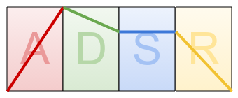

ADSR stands for *Attack, Decay, Sustain, and Release*.

- *Attack* (`0-127`) - The time from silence to full volume.
- *Decay* (`0-127`) - The time from the max value to...
- *Sustain* (`0-127`) - The volume at which the note is held while pressed.
- *Release* (`0-127`) - The time from sustain to silence.

