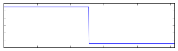
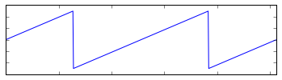
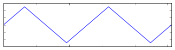
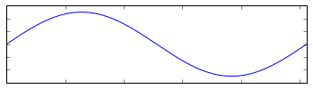
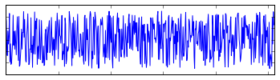
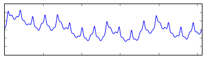

You can load one of the following waveforms.

| Value   | Name     | Waveform            |
|---------|----------|---------------------|
| 0       | Square   |    |
| 1       | Sawtooth |       |
| 2       | Triangle |  |
| 3       | Sine     |      |
| 4       | Noise    |     |
| 5       | Sample   |    |
{: class="table"}

The _Sample_ waveform is a 512B block of audio data, enough for one cycle. Call `audio.SetSample` with the address of a sample to load it. Only one sample can be used at a time.

A collection of ready-made samples can be found in the `/media/samples/` folder of the SDK.

